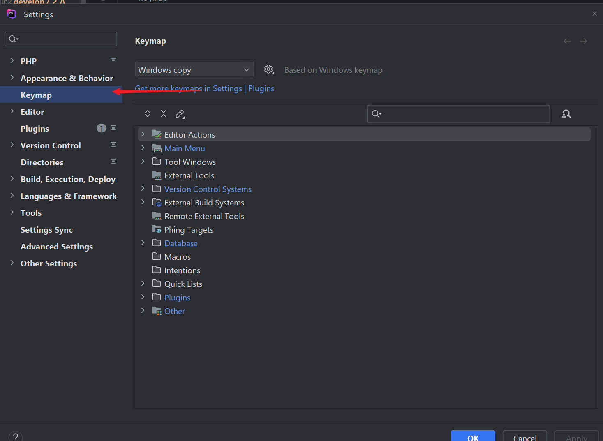

# keymap

- open setting `ctrl + ,`
- recent file `ctrl + e`
- copy current line `ctrl + d`

- file Structure 代码的结构
- Run context configure  运行代码
- Recent Files  最近打开的文件
- Add Select For Next Occurrence  多行选中
- Extend Selection 扩展选中区域
- Toggle Case  字符切换大小写