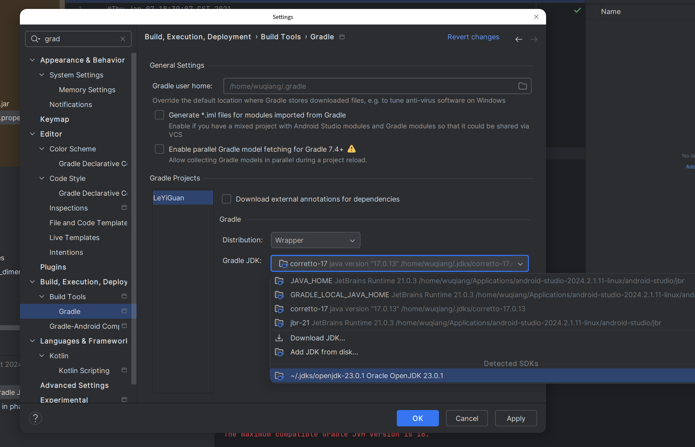

# install

manual download url : 

#  config

```sh
repositories {
    maven {
        url = uri("https://maven.aliyun.com/repository/public")
    }
    maven {
        url = uri("https://maven.aliyun.com/repository/google")
    }
    maven {
        url = uri("https://maven.aliyun.com/repository/gradle-plugin")
    }
    mavenLocal()
    mavenCentral()
}
```

change java SDK

