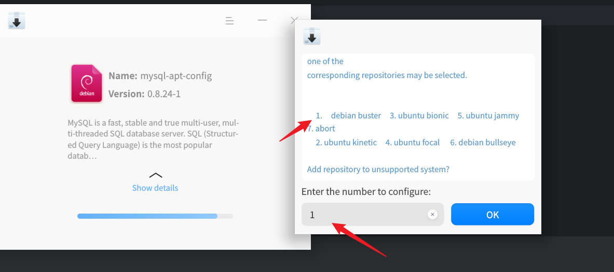
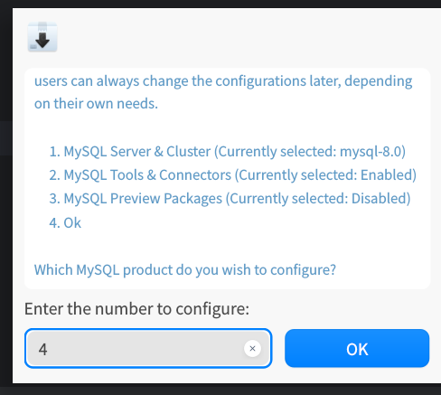

# install mysql

## deepin install

download install package 
```sh
wget https://dev.mysql.com/get/mysql-apt-config_0.8.24-1_all.deb
sudo dpkg -i mysql-apt-config_0.8.24-1_all.deb
```





after install ,run update
```sh
sudo apt update
```
if GPG error

```sh
sudo vi /etc/apt/sources.list.d/mysql.list
## add [trusted=yes] to the repository
deb [trusted=yes] http://repo.mysql.com/apt/debian/ buster mysql-apt-config 
deb [trusted=yes] http://repo.mysql.com/apt/debian/ buster mysql-8.0 
deb [trusted=yes] http://repo.mysql.com/apt/debian/ buster mysql-tools 
#deb http://repo.mysql.com/apt/debian/ buster mysql-tools-preview 
deb-src [trusted=yes]  http://repo.mysql.com/apt/debian/ buster mysql-8.0

## then run update
sudo apt update
```

install mysql

```sh
sudo apt install mysql-server -y
sudo systemctl start mysql
sudo systemctl enable mysql
mysql --version
```

open port

```sh
sudo vi /etc/mysql/mysql.conf.d/mysqld.cnf
# add config
bind-address = 0.0.0.0
```