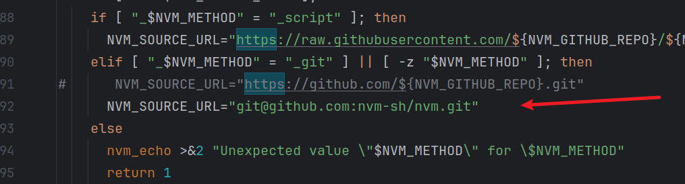

# install

* install nvm
```
curl -o- https://raw.githubusercontent.com/nvm-sh/nvm/v0.40.1/install.sh | bash
```
if github request error, change https to ssh

```sh
NVM_SOURCE_URL="git@github.com:nvm-sh/nvm.git"
```


# add shell

```
vi ~/.bash_profile

# the shell add proxy
export NVM_NODEJS_ORG_MIRROR=https://npmmirror.com/mirrors/node
export NVM_IOJS_ORG_MIRROR=https://npmmirror.com/mirrors/iojs
export NVM_DIR="$HOME/.config/nvm"
[ -s "$NVM_DIR/nvm.sh" ] && \. "$NVM_DIR/nvm.sh"  # This loads nvm
[ -s "$NVM_DIR/bash_completion" ] && \. "$NVM_DIR/bash_completion"  # This loads nvm bash_completion

# end

# make it change
source ~/.bashrc
```

# install node
```
nvm list-remote
nvm install 22
nvm use 22
node -v
```

# npm config
```
npm config set registry https://registry.npmmirror.com
```