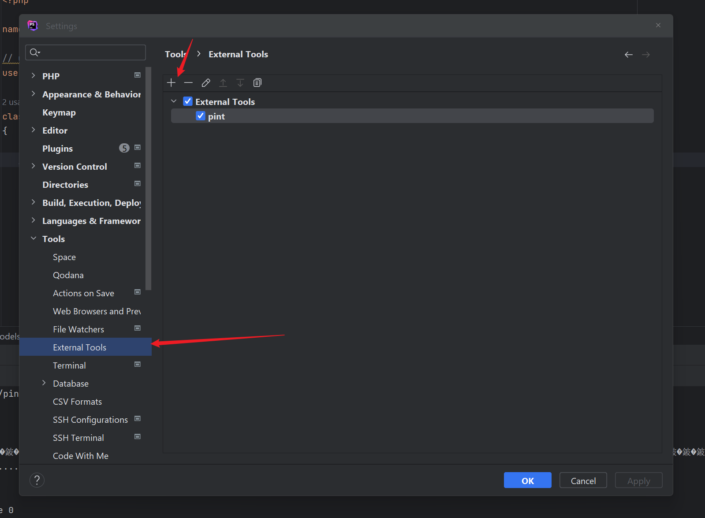
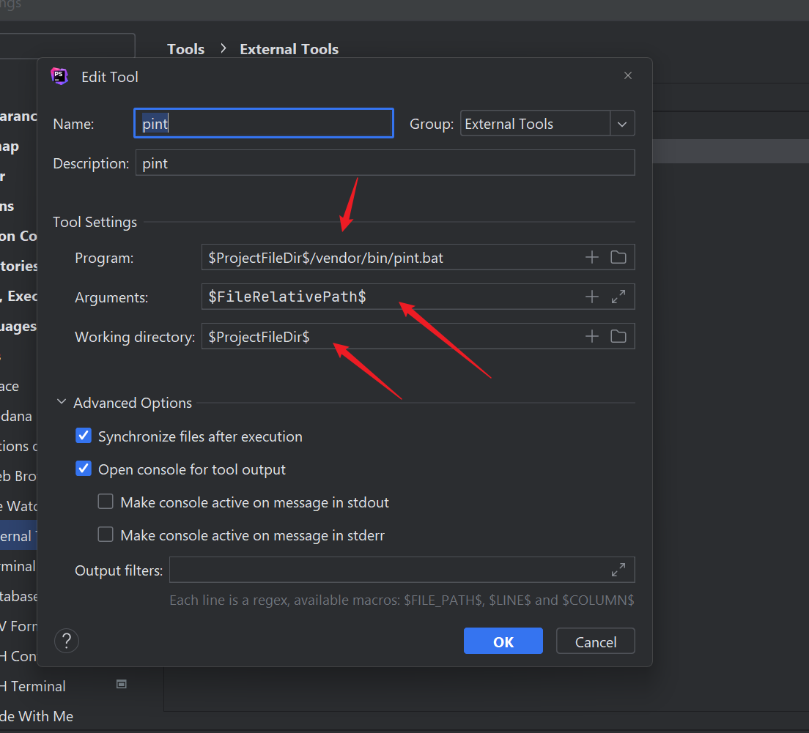
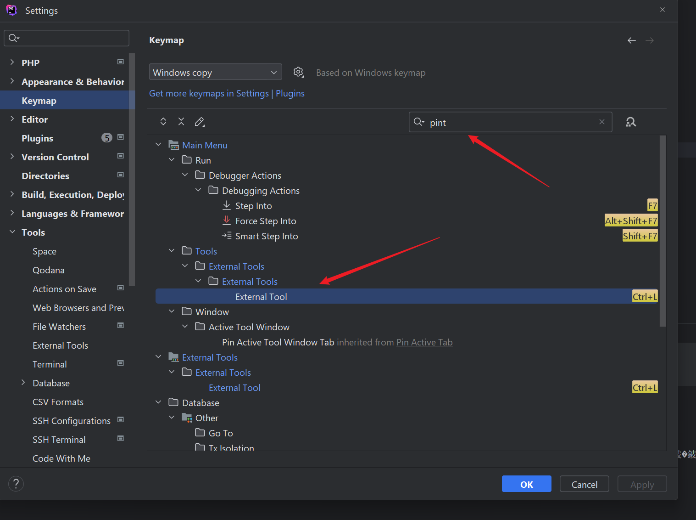

# External Tools

### Is in Setting > Tools> External Tools
click add

### add pint ,you can select the variable to your project bash for the file

* $ProjectFileDir$/vendor/bin/pint  
* $FileRelativePath$

### then add a keymap , search pint and set a the keymap you want

